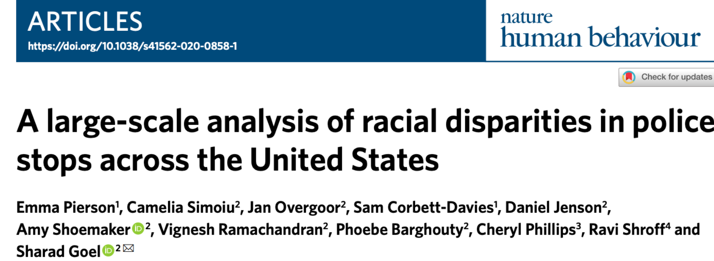

# Welcome to Our Group Project:   Predicting Outcomes of Policy Stop

## Our Problem

Our group wants to study correlations between factors like gender, age, etc., and the outcomes of police stops in North Carolina. We found an example paper on "racial disparities in police stops" from the link: https://5harad.com/papers/100M-stops.pdf. Our project's data contains stop records from 2000.1.1 to 2015.12.31 of 6 counties in North Carolina. Our goal of this project is to classify the reason/outcomes of a police stop based on the subject's personal information.

We chose this topic because being stopped on the road is one of the most common situations for people interacting with police. Understanding the reasons for the stops can help drivers drive more safely and police work more efficiently.

## Project Origination

## Our Main Goal
We want to To classify the reason/outcomes of a police stop based on the subject's personal information.

## Alternative Goal
Is there a relationship between the outcome of a police stop and the subject's gender, age, etc.?

## Project Scope 

- Data Cleaning+Concatenation: The data we found is messy and difficult to understand and data from different counties can be different. We will need to write scripts to clean them and store the data in a common format. 
- Data Visualization: We will graph various variables against our target (whether a person gets stopped by the police) in various forms in order to get a more understandable picture of their relationship.
- Database: We need to have a database because our data sets are large and have many columns so it may be faster to query for relevant data. Normalizing our data before putting it into our database will also make comparing data much easier later on. 
- Machine Learning Models: Several demo models on the reason and outcome for a police stop based on policy stop records from 2000.1.1 to 2015.12.31 of 6 counties in North Carolina.

